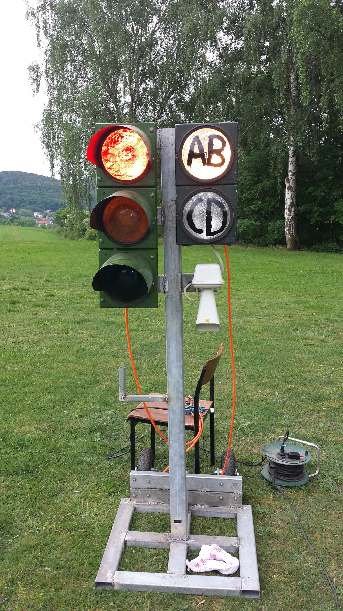
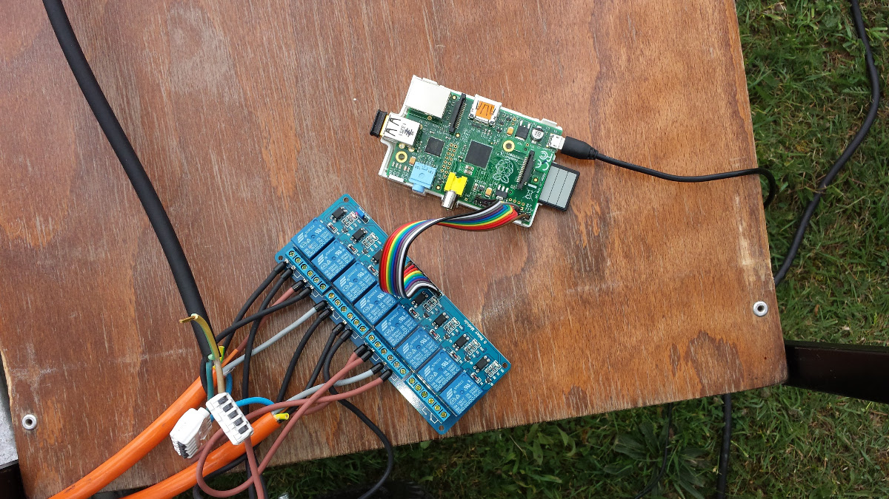
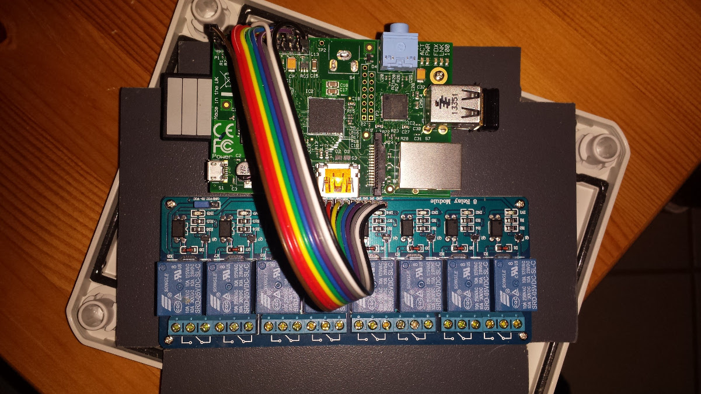
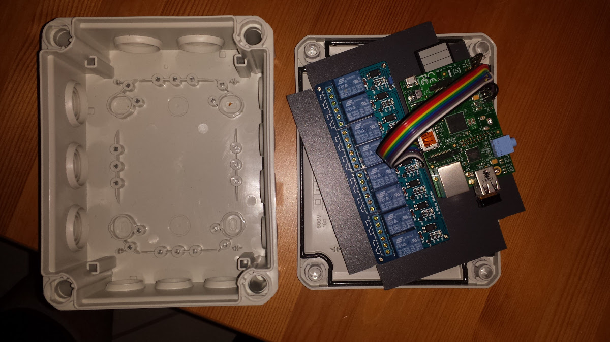

# ArcherLights

Dieses Projekt dient zur Steuerung einer Optischen- und Akkustischen-Anlage für das Bogenschießen.

Die Ampel-Anlage selbst wird über einen RaspberryPI angesteuert. Der RaspberryPI schlatet über die in diesem Projekt enthaltene Software ein Relais-Board, welche die 230V-Spannung für die Ampel regelt.

Für die Zentrale Kontroll-Einheit kann ein Laptop mit JAVA genutzt werden.
Die kommunikation der Komponenten untereinander geschieht über WLAN. Ein WLAN-Router ist daher vorraussetzung für die Anlage.

Vorzeil der Anlage:
* Die Ampel benötigt lediglich einen Strom-Anschluss
* Die Ampeln sind theoretisch beliebig erweiterbar

Projektübersicht:
* LIGHTS/ 
  Enthält den nodejs-code für die Ampelsteuerung sowie die Ansible-Rolle zum einrichten des RaspberryPI
* CONTROLLER/ 
  Enthält den JAVA-Code für die Steuerung
* docs/ 
  Dokumente

## Bilder

## Video

<iframe width="560" height="315" src="https://www.youtube.com/embed/vV-KeMpcDqQ" frameborder="0" allowfullscreen></iframe>

# Einzelteile-Liste

 * Ampel (Rot/Gelb/Grün) 
   ggf. bei ebay-kleinanzeigen (ca. 40€)
 * Ampel (AB/CD) 
   ggf. bei ebay-kleinanzeigen (ca. 30€) - Es ist darauf zu achten, dass die Gläser dieser Ampel weiß sind!
 * Nebelhorn 
   ggf. bei ebay-kleinanzeigen (ca. 25€)
 * RaspberryPI
   Bei Amazon oder anderen (ca. 40€) - [Beispiel](https://www.amazon.de/Raspberry-Pi-3-Model-B/dp/B01CEFWQFA)
 * 8-Fach-RelaisBoard
   Bei Amazon oder anderen (ca. 5€) - [Beispiel](https://www.amazon.de/Kanal-Relay-Relais-Module-Arduino/dp/B00AEIDWXK)
 * USB WLAN-Stick 
   Bei Amazon oder anderen (ca. 7€) - [Beispiel](https://www.amazon.de/EDIMAX-EW-7811UN-Wireless-Adapter-IEEE802-11b/dp/B003MTTJOY)
 * USB-Netzteil für den PI 
   Bei Amazon oder anderen (ca. 11€) - [Beispiel](https://www.amazon.de/gp/product/B00OCIXTTK)
 * Kabel/Gehäuse/Gestell
 * WLAN-Router 
   Alter FritzBox! oder ähnliches mit WLAN-Modul
 * Laptop
 
Die Material-Kosten leigen insgesamt bei ca. 200€-250€.
   
